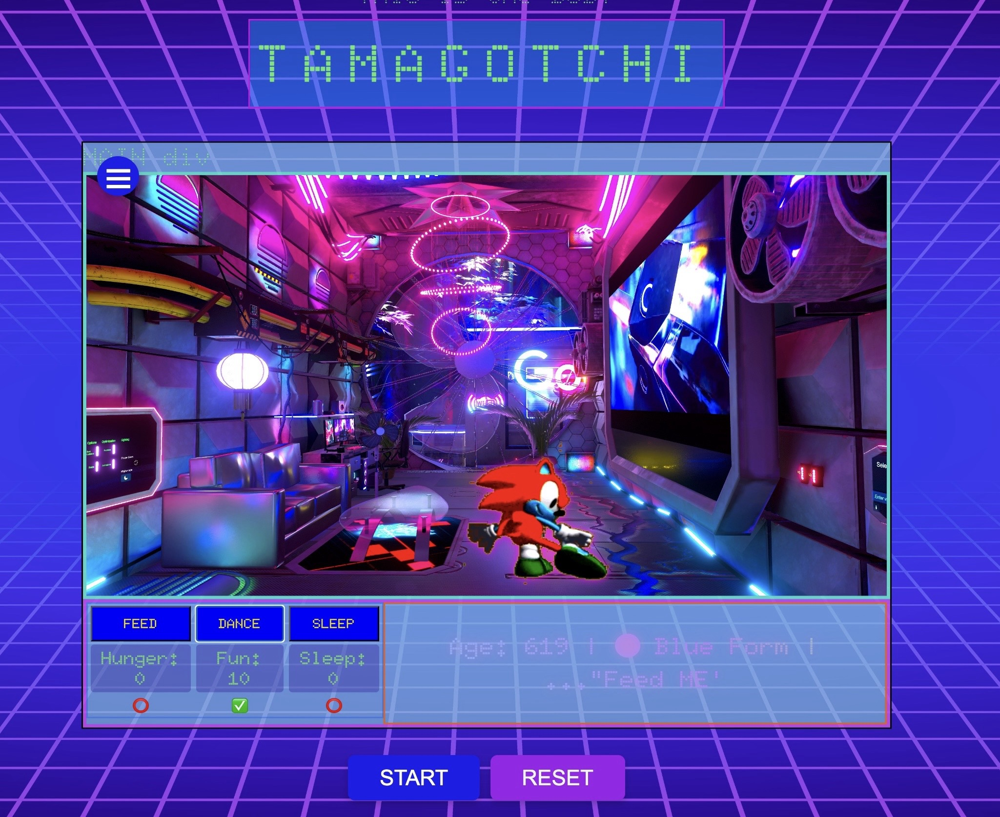
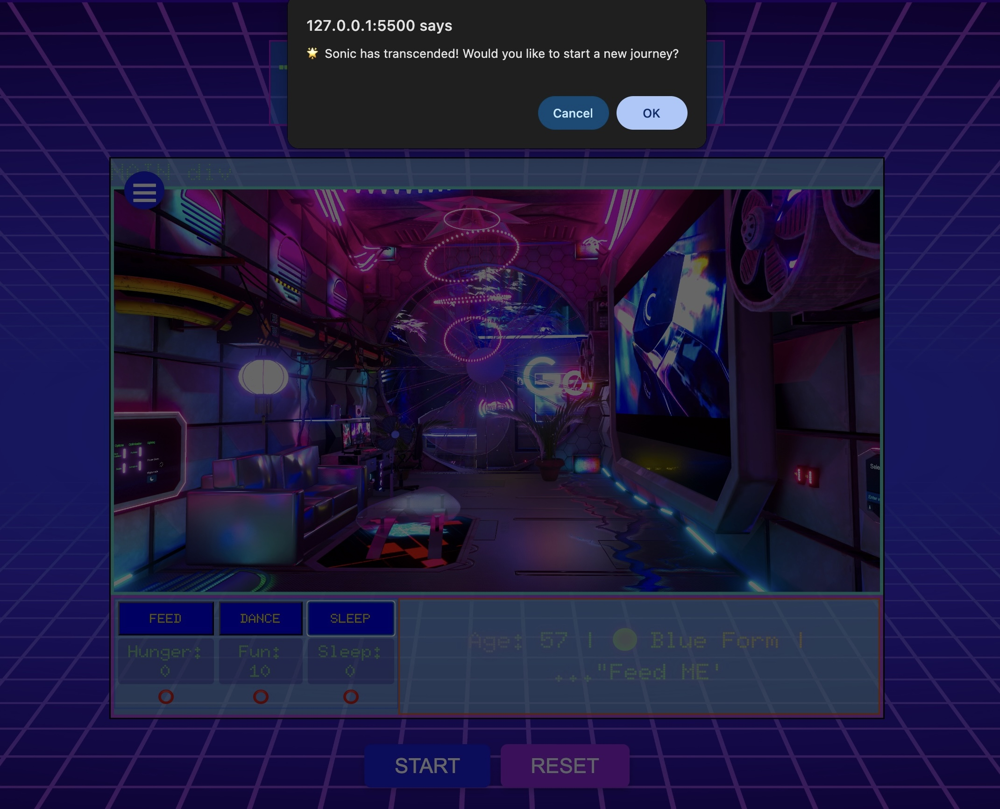

> A Tamagotchi-inspired game where your digital pet evolves through the emotional spectrum of existence… and eventually transcends.

---

## 🎮 Game Summary

**Tamagotchi Transcendence** is an emotional evolution simulator. Players hatch a virtual pet out of a glitched egg in a frozen, pulsating embryonic state. Hatching out of it is an intergalactic pet who evolves by changing its color, mimicking variants of the spectrum of light. The player must keep it alive and happy by feeding, dancing, and resting.

The pet evolves through emotional and visual stages: innocence (blue), growth (green), joy/power (yellow), peak energy/fury (red), and transcendence (a glowing white/translucence).

If neglected, the pet can die and fade out of reality. Success means evolving the pet to its final form, where it vanishes from the visible world, representing transcendence.

---

## 📈 How to Win

- Keep your pet alive and emotionally fulfilled
- Complete a full care cycle (Feed + Dance + Sleep) to increase age
- Reach **Stage 5 – White Form** and trigger the **Transcendence sequence**

## ☠️ How to Lose

- If hunger, boredom, or exhaustion reaches 0
- The pet fades away from the simulation and the game ends

---

## 🌈 Evolution Stages (Current Demo Path)

1. 🔵 **Blue** – Innocence
2. 🟢 **Green** – Growth/Energy
3. 🟡 **Yellow** – Power
4. 🔴 **Red** – Fury
5. ⚪ **White** – Transcendence

> _Note:_ You may also choose to use your original alternate evolution path in the future (Pink, Purple, etc.).

---

## 🧠 Gameplay Loop (Pseudocode Summary)

```plaintext

START
- Page overlay with intro to and prologue of the game.


START/RESET
- Show glitch overlay
- User clicks "Start" → egg appears → hatch animation plays

GAME LOOP
- On each care cycle (Feed → Dance → Sleep):
    - Increase pet's age by 5
    - If age matches evolution threshold (5, 10, 15, 20), evolve pet

USER ACTIONS
- Feed → hunger bar replenishes
- Dance → fun bar increases
- Sleep → tiredness decreases
- Reset → returns game to glitch egg state

WIN CONDITION
- Reach Age 20 (White stage) → Transcendence sequence triggers

LOSE CONDITION
- If any stat reaches 0 → Pet fades and simulation ends

RESET:
  - Reset button resets all variables & visuals


## 🎮 Game Screenshots

### 🌀 Intro Screen


### 🥚 Glitch Egg Stage


### 🐣 Hatched Pet (Blue Form)


### 🔴 Red Evolution Stage


### ⚪️ Final Transcendence


```
